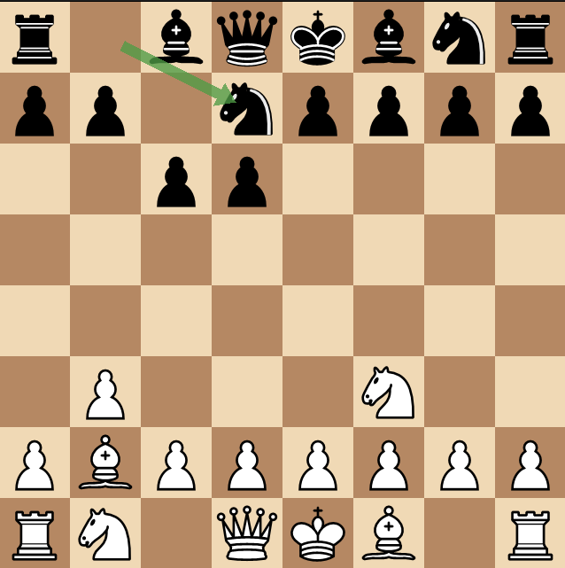

# Neuro Gambit 2
A chessbot trained on Lichess data using a custom recurrent transformer model that is based on Andrej Karpathy's nanoGPT.



# Setup

```bash
python3 -m venv .venv
source .venv/bin/activate
pip install -r requirements.txt
```

### ROCm

Double check if that is the ROCm version of your AMD GPU. Mine is RX 9060-class

```bash
pip install -r requirements-rocm.txt
python check_gpu.py
```

### CUDA

Otherwise if you have a CUDA GPU

```bash
pip install -r requirements-cuda.txt
python check_gpu.py
```

### Stockfish

For Debian/Ubuntu

```bash
sudo apt install stockfish
```

For macOS

```bash
brew install stockfish
```

# Data

You can download a chess PGN from [database.lichess.org](https://database.lichess.org/) by running:

```bash
mkdir -p data/raw && cd data/raw
curl -L -O https://database.lichess.org/standard/lichess_db_standard_rated_2017-02.pgn.zst
zstd -d lichess_db_standard_rated_2017-02.pgn.zst
cd ../..
```

Set `DATA_PATH` in `generate_data.py` to the path of the downloaded PGN. I used the data from July 2017 as it is relatively small, but you can also download a larger dataset.

Also, in case you don't have `zstd`, you can install it with 
```bash
sudo apt install zstd
```

After that, run
```bash
python generate_data.py
```
This will preprocess the data and filter out lower elo games.

You can also preview any game from the preprocessed data by running
```bash
python preview_data.py 0 # or any index value
```

Then you will need to create the batches for training by running
```bash
python generate_batches.py
```

# Train
After the data is ready, you can train the model by running
```bash
python train.py
```

This will train the model for `EPOCHS` epochs (default is 3 which you can find in `constants.py`), and evaluate the validation set after each epoch.

To test the model, run
```bash
python test.py
```

This will evaluate the model on the test set and print the accuracy.

# Results
Training with **3 epochs**, **16 context size**, **8 heads**, **4 loops** was able to achieve a **2.3251 test loss** and an **accuracy of 32.8%**. Which took **1 hour** on my laptop's NVIDIA GeForce RTX 3070 Ti GPU.

# Motivation and Conclusion
Part of the idea of this project was to see if LLM models can learn how to solve specific problems by modifying the vocabulary of the tokenizer to be specific to the problem: meaning that the problem is describable as a sequence of tokens.

Chess is a good example of that where the entire chess board can be represented as a sequence of tokens and the potential moves that the model can make are represented as UCI move strings.

The model is able to learn how to play, but it does seem to struggle with very irregular moves that it was not trained on. Next steps could be to do some RL training to improve the model's performance on irregular moves, as well as just scaling the model.

An aspect to consider with scaling though, is that I am using recurrent transformers to see how small models can be used, and so there are two scaling axes: the model size (how many blocks) and the loop number (how many times the model is unrolled). Moreoever, using an illegal move mask during training and inference really pushes the model since it makes it consider way less moves at every step: which decreases the negative log likelihood by a good amount (from ln(4545) to ln(~20) for completely random moves).

Lastly, this project was also done so I can learn and understand how LLM models work and how I can experiment with different model architectures and training techniques. This has been the culmination of all my research during summer 2026.

Originally back in 2023, [I attempted to make a simple MLP model learn how to play chess](https://github.com/NabilNYMansour/Neuro-Gambit) (with not a lot of success) and that was the first Neuro Gambit project, but it was not a good starting point for this project.
